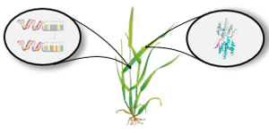

  

      <ul class="nav">
          <li><a href="{{ BASE_PATH }}/assets/BlackGrassBulletin_Issue1.pdf">Bulletin 1</a></li>
          <li><a href="{{ BASE_PATH }}/assets/BlackGrassBulletin_Issue2.pdf">Bulletin 2</a></li>
          <li><a href="{{ BASE_PATH }}/assets/BlackGrassBulletin_Issue3.pdf">Bulletin 3</a></li>
          <li><a href="{{ BASE_PATH }}/assets/BlackGrassBulletin_Issue4.pdf">Bulletin 4</a></li>
          <li><a href="{{ BASE_PATH }}/assets/BlackGrassBulletin_Issue5.pdf">Bulletin 5</a></li>
      </ul>
  

<table class="wide">
<tr>
  <td class="left">
    
  </td>
  <td class="right">
    
  </td>
</tr>
<tr>
  <td class="left">
    
  </td>
  <td class="right">
    
  </td>
</tr>
</table>

  

      <ul class="nav">
          <li><a href="morefigs.html">more information</a></li>
      </ul>
  

